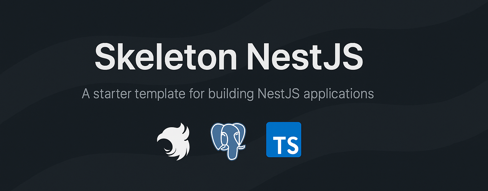

<h1 align="center">
  Skeleton NestJS
</h1>


<div align="center">

</a>

<p></p>

<span>&nbsp;&nbsp;•&nbsp;&nbsp;</span>
<a href="#-getting-started">🤝 Contribute</a>
<span>&nbsp;&nbsp;•&nbsp;&nbsp;</span>

</div>

# 🧱 Skeleton NestJS Project

Este proyecto es un **template base** para aplicaciones NestJS, actualmente en construcción y con futuras mejoras planificadas.  
Está pensado para ofrecer una estructura escalable, herramientas modernas de desarrollo, y buenas prácticas integradas desde el inicio.

---
## 🚀 Características Incluidas

- ⚙️ **TypeORM** – ORM para PostgreSQL con soporte para relaciones, repositorios, y migraciones personalizadas.
- 🧬 **Graphile Migrate** – Herramienta de migraciones SQL basada en archivos, con control explícito del esquema.
- 🧾 **Commitlint** – Validación de mensajes de commits bajo convención (Conventional Commits).
- 🎯 **Lefthook** – Hooks automáticos para lint, test, etc. al hacer commits.
- 🎨 **Prettier** – Formateador de código consistente.
- 🧹 **ESLint** – Análisis estático de calidad de código con reglas extendidas para TypeScript.
- 🌍 **Manejo de entornos** – Soporte claro para `.env.dev` y `.env.prod` con `cross-env` y scripts segmentados.

---
## 🛠️ Estructura de entorno

```bash
.
├── src/
│   ├── common/                 # Utilidades compartidas como filtros globales o helpers
│   ├── config/                 # Configuraciones del sistema (env validation, swagger, etc.)
│   ├── database/               # Configuración de TypeORM y entidades base
│   │   ├── entity/             # Entidades reutilizables (ej. BaseEntity con timestamps)
│   ├── modules/               # Módulos organizados por dominio (ej. admin, auth)
│   │   ├── admin/              # Módulo de administración
│   │   ├── auth/               # (Pendiente de implementación) Módulo de autenticación
│   ├── utils/                  # Funciones auxiliares o wrappers del proyecto
│   ├── app.module.ts          # Módulo raíz de la aplicación NestJS
│   └── main.ts                # Punto de entrada principal
│
├── migrations/                # Archivos SQL de migraciones generados por graphile-migrate
├── scripts/                   # Scripts utilitarios (ej. migrate.sh para cargar env y ejecutar)
├── test/                      # Tests de integración y unitarios
│
├── .env.dev                   # Variables de entorno para desarrollo
├── .env.prod                  # Variables de entorno para producción
├── .env.example               # Archivo ejemplo de configuración de entorno
│
├── .gmrc.js                   # Configuración de graphile-migrate
├── docker-compose.yml         # Orquestación de servicios externos como PostgreSQL
├── package.json               # Dependencias y scripts
├── README.md                  # Documentación principal del proyecto
└── tsconfig*.json             # Configuración de TypeScript para compilación y paths

```

## 🛠️ Pasos para empezar a desarrollar
### 1. Clona el repositorio
```bash
git clone https://github.com/Proyectos-X/skeleton-nestjs
cd skeleton-nestjs
```

### 2. Instala las dependencias
```bash
yarn install
```

### 3. Copia el archivo de ejemplo y edita tus variables:
```bash
cp .env.example .env.dev
```

### 4. Aplica las migraciones
```bash
yarn db:migrate:dev
```

### 5. Inicia la aplicación
```bash
yarn start:dev
```

### 🧪 Scripts útiles

| Comando              | Descripción                                                      |
|----------------------|------------------------------------------------------------------|
| `yarn start:dev`     | Inicia NestJS en modo desarrollo                                 |
| `yarn db:watch:dev`  | Aplica `current.sql` automáticamente al guardar                  |
| `yarn db:commit:dev` | Confirma la migración actual y la guarda en `committed/`         |
| `yarn db:migrate:dev`| Ejecuta todas las migraciones confirmadas                        |
| `yarn db:reset:dev`  | Elimina y reconstruye la base de datos desde cero                |
| `yarn lint`          | Ejecuta ESLint y Prettier                                        |
| `yarn test`          | Corre los tests con Jest                                         |


## Opciones de compilación

```bash
# development
$ yarn run start

# watch mode
$ yarn run start:dev

# production mode
$ yarn run start:prod
```

## Run tests

```bash
# unit tests
$ yarn run test

# e2e tests
$ yarn run test:e2e

# test coverage
$ yarn run test:cov
```


## Stay in touch

- Author - [Guillermo Zevallos](https://github.com/ZevaGuillo)

## License

Nest is [MIT licensed](https://github.com/nestjs/nest/blob/master/LICENSE).

> ⚠️ **Nota**: Este template aún está en desarrollo activo.  
> Se esperan futuras implementaciones como autenticación, sistema de permisos, seeders, testing e2e y CI/CD.
